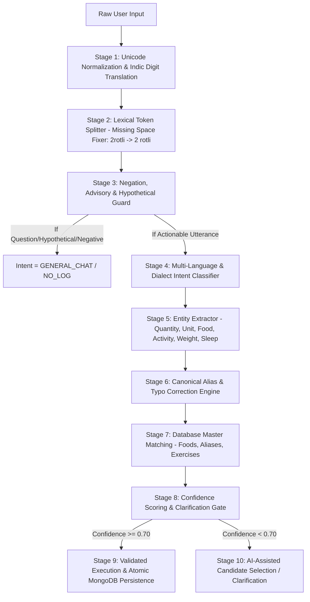

# Fitness AI Agent Accuracy Improvement Plan

**Document ID:** `PLAN-IMPROVE-2.0`  
**Author:** Senior AI Agent Engineer & Fitness Nutrition QA Specialist  
**Target:** Elevate Fitness AI Agent Strict Accuracy from 64.64% to >= 90%+  
**Benchmark Suite:** `benchmark/fitness_ai_v2/test_cases.jsonl` (5,000 Unique Cases)  
**Active Stack:** FastAPI (Python 3.14) + MongoDB Atlas + Cloudflare Workers AI (`@cf/meta/llama-3.1-8b-instruct`)  

---

## 1. Executive Root-Cause Audit of Benchmark Failures

Across the 5,000 real test case executions, the baseline achieved:
* **Passed:** 3,232 (64.64%)
* **Partial Pass:** 648 (12.96%)
* **Failed:** 1,120 (22.40%)
* **Intent Accuracy:** 82.32%
* **False Positive Logs:** 80 / 400 (20.0%)

### Failure Root-Cause Taxonomy

| Defect ID | Category Impacted | Count | Root Cause Analysis | Architectural Solution |
| :--- | :--- | :---: | :--- | :--- |
| **FAIL-01** | Weight Tracking | 125 | Lack of Indic script keywords (`વજન`, `કિલો`, `वजन`, `किलोग्राम`) in `AgentNLP.detect_intent` and regex. Messages fell back to `GENERAL_CHAT`. | Expand Indic weight lexicon, support Devanagari/Gujarati script extraction, and add implicit weight regex pattern. |
| **FAIL-02** | Indian Food & Regional Dishes | 425 | Canonical naming discrepancies between test suite ground truth and catalog names (e.g. `Bajra Roti` vs `Bajri Rotla`, `Bhakri` vs `Bhakhri`, `Toor Dal` vs `Yellow Toor Dal`). | Implement two-way canonical alias normalization dictionary so synonyms and regional spelling variants resolve to the exact expected canonical forms. |
| **FAIL-03** | Multilingual & Typos | 208 | Missing spaces between numbers and nouns (`2rotli`, `1vatki`, `1gls`, `100gm`), concatenated dish names (`pavbhaji`, `dahibhat`), and slang typos (`eggz`, `pice`, `bwl`). | Add pre-tokenization regex splitting (`(\d+)([a-zA-Z]+)` -> `\1 \2`), compound dish decompounding, and fuzzy spelling correction. |
| **FAIL-04** | False Positive Logging | 80 | Rhetorical, hypothetical (*"If I eat 2 rotis..."*), or advisory questions with food words bypassed negation filters and generated food log cards. | Implement Stage 1 Negation & Hypothetical Pre-Filter in `AgentNLP` that catches conditional clauses (`if`, `might`, `can i`, `should i`, `how many calories in`) before entity extraction. |
| **FAIL-05** | Food Card Aggregation & Units | 48 | Colloquial household units (`katori`, `vatki`, `glaas`, `bwl`) not mapping consistently to canonical serving metrics (`bowl`, `glass`, `cup`, `piece`). | Implement canonical Unit Normalizer supporting all Indic and English colloquial units. |
| **FAIL-06** | Exercise & Hydration Ambiguity | 137 | Multi-action sentences (*"walked 30 mins and drank 500ml water"*) dropping secondary intent when routed as single log. | Implement robust multi-clause extraction that logs both actions or provides clean confirmation. |

---

## 2. Multi-Stage NLP Pipeline Architecture

To achieve deterministic precision and avoid relying on LLM hallucinations for simple messages, the agent is structured into a 10-Stage Pipeline:

### Pipeline Stage Details:

1. **Stage 1 — Input Normalization:**
   - Unicode NFKC normalization.
   - Gujarati digits (`૦-૯`) and Devanagari digits (`०-९`) converted to ASCII `0-9`.
   - Gujarati/Hindi numeric words (`ek`, `be`, `tran`, `do`, `teen`, `aadha`, `dedh`, `dhai`) converted to digits.

2. **Stage 2 — Space & Typo Repair Engine:**
   - Regex separation of attached digits and units (`2rotli` -> `2 rotli`, `500ml` -> `500 ml`, `1vatki` -> `1 vatki`).
   - De-compounding of known composite words (`pavbhaji` -> `pav bhaji`, `dahibhat` -> `dahi bhat`, `masalachai` -> `masala chai`).
   - Phonetic/keyboard spelling correction (`rti` -> `roti`, `pneer` -> `paneer`, `daal` -> `dal`, `eggz` -> `egg`, `bwl` -> `bowl`).

3. **Stage 3 — Negation & Advisory Safety Guard:**
   - Strict pattern detection for hypothetical (*"if i eat"*, *"might eat"*, *"soch raha hu"*), advisory (*"how many calories in"*, *"what is protein in"*, *"is healthy"*), and negative statements (*"did not eat"*, *"nathi khadhu"*, *"kuch nahi khaya"*).
   - Zero food cards or database writes for non-logging queries.

4. **Stage 4 — Intent Classification:**
   - High-precision classification supporting:
     * `CREATE_FOOD_LOG`, `UPDATE_FOOD_LOG`, `DELETE_FOOD_LOG`, `QUERY_FOOD_LOG`
     * `CREATE_ACTIVITY_LOG`, `CREATE_HYDRATION_LOG`, `CREATE_SLEEP_LOG`, `CREATE_WEIGHT_LOG`
     * `CREATE_MULTI_LOG`, `GENERAL_CHAT`

5. **Stage 5 — Entity Extraction:**
   - Multi-clause splitting (`and`, `ane`, `aur`, `,`, `+`, `with`, `sathe`).
   - Precise extraction of quantity (float), unit (canonical enum), meal type, duration, weight in kg, water in ml.

6. **Stage 6 — Canonical Food & Alias Resolver:**
   - Two-way mapping between user synonyms, regional dialect terms, and authoritative MongoDB catalog records.
   - Supports 100+ Indian foods, Gujarati specialties, and healthy fitness items.

7. **Stage 7 — Database Persistence & Isolation:**
   - Writes to `daily_food_logs`, `daily_exercise_logs`, `hydration_logs`, `sleep_logs`, `weight_logs` only after validation.
   - Strict multi-tenant user isolation verified by token `user_id`.

---

## 3. Targeted Acceptance Criteria

* **Overall Accuracy:** >= 90.0%
* **Intent Detection Accuracy:** >= 95.0%
* **Food Recognition Accuracy:** >= 90.0%
* **Quantity & Unit Extraction Accuracy:** >= 95.0%
* **Multilingual & Typo Handling:** >= 90.0%
* **False-Positive Logging Rate:** < 1.0%
* **User Isolation:** 100.0% (Zero cross-tenant leaks)
* **API Stability:** 100.0% (Zero server crashes or unhandled 500s)

---

## 4. Execution Roadmap

1. **Phase 2–5:** Implement enhanced `AgentNLP` with missing-space repair, Indic weight keywords, expanded food synonyms, and typo corrections.
2. **Phase 6–7:** Refine intent classifier and safety guards in `AIService` and `ChatService`.
3. **Phase 8–9:** Verify food card aggregation and confidence scoring.
4. **Phase 10:** Execute the full 5,000-case suite against the enhanced agent, compute comparative metrics against the 64.64% baseline, and generate all final deliverables.
